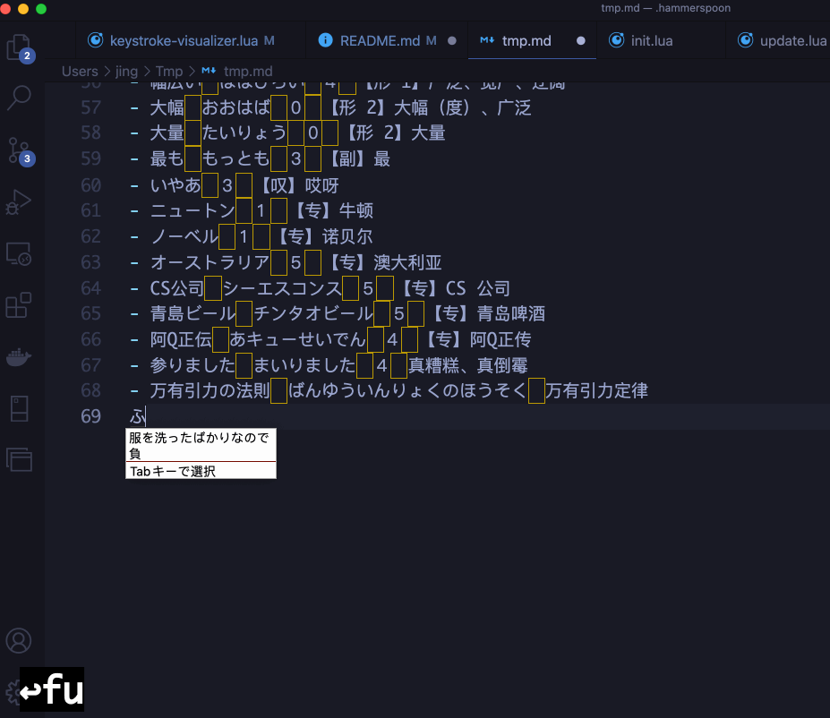

<div align='center'>
    
</div>

<div align='center'>
  
  
  
</div>

[English](./README.md) | 简体中文 | [日本語](./README-JP.md)

---

- 如果你觉得本工程提供的功能对你有用，请帮忙点一个 Star，不胜感激，谢谢！
- 若 README 图片无法显示，请确保挂了梯子，并且 PAC 文件中配置 `||githubusercontent.com`，或者直接使用全局模式

---

## 如何安装

本工程所有脚本都基于 Hammerspoon 运行，请先下载安装 [Hammerspoon](https://github.com/Hammerspoon/hammerspoon/releases)，然后再执行如下命令：

```shell
curl -fsSL https://raw.githubusercontent.com/KURANADO2/hammerspoon-kuranado/main/install.sh | sh
```

如上面这条 `curl` 命令下载不了 `install.sh`，则请打开终端代理后重试或手动下载 `install.sh` 后执行

最后，Menubar 中点击 Hammerspoon `Reload Config` 按钮即可

---

## 手动更新

手动安装更新：

```shell
cd ~/.hammerspoon
git pull origin main
```

如果发现冲突，请解决冲突后再执行 `git pull origin main`

---

## 自动更新

除手动更新外，本工程还支持自动检查更新并安装，可在功能菜单中关闭自动更新（不建议）

自动更新原理如下：
- .config 文件（用户配置文件）加入到 .gitignore 文件中
- 定期执行 `git pull origin main`
- 如果发现冲突，则 console 打印自动更新失败相关提示信息，此时请手动安装更新，参考：[手动更新](https://github.com/KURANADO2/hammerspoon-kuranado#%E6%89%8B%E5%8A%A8%E6%9B%B4%E6%96%B0)
- 如果发现默认配置版本号 > 用户本地 .config 文件的配置版本号，则在保留用户原有配置的基础上，将新增配置合并到用户本地 .config 文件中，并更新配置版本号

---

## 本工程提供功能
### 功能菜单

鼠标单击功能项，即可启用/禁用功能项

<div align='center'>
  
</div>

---

### 窗口移动

替代 [Magnet](https://apps.apple.com/us/app/magnet/id441258766?mt=12) 进行窗口移动

<div align='center'>
  
</div>

---

### 应用切换

为应用配置快捷键，比 `⌘` `⇥` 和 Alfred 切换程序更高效（建议只为高频使用的一些软件分配快捷键）

---

### 表情包搜索

快捷键 `⌥` `K` 唤醒表情包搜索功能，输入关键词，**上下**键用于选择、预览表情包；**左右**键用于翻页；**回车键**用于发送表情包；`Esc` 关闭搜索窗口

<div align='center'>
  
</div>

**注：** 该功能我曾在 Alfred Workflow 中实现过一遍：[https://github.com/KURANADO2/emoji-alfredworkflow](https://github.com/KURANADO2/emoji-alfredworkflow)。但已很久没有维护，如果你对 Alfred 感兴趣，也可以看下

---

### 实时网速显示

替代 [NetWorker Pro](https://apps.apple.com/us/app/networker-pro/id1163602886?mt=12) 实时显示网速（每两秒刷新一次）

<div align='center'>
  
</div>

---

### 密码粘贴

解决某些网站禁止粘贴密码、SSH 登陆需要手动输入密码等问题。
首先使用 `⌘` `C` 复制密码，然后在密码输入框内，按 `⌃` `⌘` `V` 即可将密码粘贴到输入框内。
原理为读取剪贴板最新一条记录，针对读取到的每一个字符，模拟按键事件。

---

### 输入法切换

使用快捷键 `⌥` `L` 在简体拼音和平假名输入法中切换

个人最常用的三个输入法：
- 系统自带 ABC
- 系统自带简体拼音
- 谷歌日语输入法

<div align='center'>
  
</div>

<div align='center'>
  
</div>

在简体拼音和 ABC 之间使用 `⇪` 键切换倒没什么，但在简体拼音和日语输入法间切换一直以来都是我最大的噩梦。使用系统自带的切换快捷键 `⌃` `space`：

<div align='center'>
  
</div>

第一：弹框会有一定延迟（难以忍受），第二：需要反复按 `⌃` `space` 在所有输入法中轮流切换（总是会切过，然后重新转一圈）。每天需要在**同一个应用内**做上百次这种切换，着实令人恐惧。

这里我提供一种切换方案，其它同学如果有更合理的方案也欢迎提出：

当前输入法|快捷键|切换到
-|-|-
ABC/日语输入法|`⌥` `L`|简体拼音
简体拼音|`⌥` `L`|日语输入法
简体拼音|`⇪`|ABC
ABC|`⇪`|简体拼音

**注：** 也有很多人采用的是根据应用自动切换输入法，如一旦切换到 IDEA 则自动把输入法切换成 ABC，一旦进入到微信，则自动把输入法切换到简体拼音...，这的确是很好的方案，Hammerspoon 当然也可以实现，但这种方案却不太适用于我。

---

### 按键回显

替代 [KeyCastr](https://github.com/keycastr/keycastr)

<div align='center'>
  
</div>

注：目前暂且实现了简单的按键回显，和 KeyCastr 相比在功能上仍相差甚远，如：
- 不支持多画布
- 画布不支持拖拽
- 缺少动画效果
- ...
感兴趣的同学欢迎提出实现思路，或直接贡献代码（不太懂 Objective-C，KeyCastr 的实现源码个人看不太懂）

---

### 快捷键列表查看

任意界面下按 `⌥` `/` 显示/隐藏快捷键列表

<div align='center'>
  
</div>

---

### 下班提醒

每天 18:00 提醒下班（根据实际下班时间自行修改脚本），鼠标点击可关闭动画

<div align='center'>
  
</div>

---

## 默认快捷键列表

如需自定义快捷键，请修改 shortcut.lua 文件，如 shortcut.lua 文件不存在，则执行如下命令创建一份

```shell
cp shortcut.lua.example shortcut.lua
```

快捷键|功能
-|-
`⌃` `⌥` `←`|左半屏
`⌃` `⌥` `→`|右半屏
`⌃` `⌥` `↑`|上半屏
`⌃` `⌥` `↓`|下半屏
`⌃` `⌥` `U`|左上角
`⌃` `⌥` `I`|右上角
`⌃` `⌥` `J`|左下角
`⌃` `⌥` `K`|右下角
`⌃` `⌥` `1`|1/9
`⌃` `⌥` `2`|2/9
`⌃` `⌥` `3`|3/9
`⌃` `⌥` `4`|4/9
`⌃` `⌥` `5`|5/9
`⌃` `⌥` `6`|6/9
`⌃` `⌥` `7`|7/9
`⌃` `⌥` `8`|8/9
`⌃` `⌥` `9`|9/9
`⌃` `⌥` `C`|居中
`⌃` `⌥` `D`|左 1/3（横屏）或上 1/3（竖屏）
`⌃` `⌥` `F`|中 1/3
`⌃` `⌥` `G`|右 1/3（横屏）或下 1/3（竖屏）
`⌃` `⌥` `E`|左 2/3（横屏）或上 2/3（竖屏）
`⌃` `⌥` `T`|右 2/3（横屏）或下 2/3（竖屏）
`⌃` `⌥` `=`|等比例放大窗口
`⌃` `⌥` `-`|等比例缩小窗口
`⌃` `⌥` `↩︎`|最大化
`⌃` `⌥` `⌘` `↑`|将窗口移动到上方屏幕
`⌃` `⌥` `⌘` `↓`|将窗口移动到下方屏幕
`⌃` `⌥` `⌘` `←`|将窗口移动到左侧屏幕
`⌃` `⌥` `⌘` `→`|将窗口移动到右侧屏幕
`⌥` `Q` |打开 QQ
`⌥` `W` |打开 WeChat
`⌥` `V` |打开 Visual Studio Code
`⌥` `F` |打开 Finder
`⌥` `C` |打开 Chrome
`⌥` `J` |打开 Intellij IDEA
`⌥` `N` |打开 WizNote
`⌥` `D` |打开 DataGrip
`⌥` `T` |打开 iTerm2
`⌥` `M` |打开 MailMaster
`⌥` `P` |打开 Postman
`⌥` `O` |打开 Word
`⌥` `E` |打开 Excel
`⌥` `Y` |打开 PyCharm
`⌥` `R` |打开 Another Redis Desktop Manager
`⌥` `K` |表情包搜索
`⌃` `⌘` `V`|以模拟按键方式将剪贴板中的字符粘贴出来（解决某些网站禁止粘贴密码问题）
`⌥` `L` |在简体拼音和日语输入法间切换
`⌥` `/` |显示/隐藏快捷键列表

---

## 关于
### 关于应用 bundle id

上面配置中使用快捷键切换应用，需要拿到应用的 bundle id（请注意 bundle id 配置到 hammerspoon 中需要区分大小写，否则 console 会报错），可通过如下方式拿到：
```shell
osascript -e 'id of app "Name of App"'
```

<div align='center'>
  
</div>

另外，如果你使用的是比较新的 Mac 系统，终端下输入 `ls /Applications` 可能是看不到系统自带应用的，如下图，`ll` 查看不到 Mac 自带的邮件应用，但 Finder 打开 /Applications 目录则可以看到邮件应用

<div align='center'>
  
</div>

此时我们可以在 Finder 中选中邮件应用，右键：显示包内容 -> Contents -> 打开 info.plist 文件，找到 CFBundleIdentifier 配置项，该配置项的值即为 bundle id，当然此方法也适应于自己安装的应用

<div align='center'>
  
</div>

---

### 关于工程目录结构

```shell
.hammerspoon
├── .config 用户本地配置文件，保存了用户每个功能模块的启用/禁用状态
├── .emoji 表情包缓存目录
├── .git
├── .gitignore
├── LICENSE
├── README.md
├── images 功能模块及 README 需要用到的图片
├── init.lua 脚本入口
└── modules 各个功能模块
    ├── application.lua 应用切换模块
    ├── base.lua 封装了 Lua 基本工具
    ├── config.lua 菜单默认配置，记录了每一项功能的默认启用/禁用状态
    ├── emoji.lua 表情包搜索模块
    ├── hotkey.lua 快捷键列表查看模块
    ├── input-method.lua 输入法切换
    ├── keystroke-visualizer.lua 按键回显模块
    ├── menu.lua 菜单模块
    ├── network.lua 实时网速模块
    ├── password.lua 密码粘贴模块
    ├── reload.lua 重载配置模块（当 ～/.hammerspoon 目录下任意 .lua 文件发生变动时，自动重新加载 Hammerspoon 配置）
    ├── remind.lua 下班提醒模块
    ├── shortcut.lua 用于用户自定义快捷键，此文件已加入 .gitignore，若无该文件，则执行命令 cp shortcut.lua.example shortcut.lua 创建一份即可
    ├── shortcut.lua.example 快捷键配置文件示例，用户请勿修改此文件
    ├── update.lua 自动更新模块
    └── window.lua 窗口管理模块
```

---

## 参考

- [学长博客 - OSX--OSX应用快速切换方案](https://mrdear.cn/posts/osx_app_switcher.html)
- [官方 Quick Start](https://www.hammerspoon.org/go/)
- [官方文档](http://www.hammerspoon.org/docs/)
- [hammerspoon-init](https://github.com/rtoshiro/hammerspoon-init)
- [Easily see any app’s bundle identifier](https://robservatory.com/easily-see-any-apps-bundle-identifier/)
- [GitHub - wangshub/hammerspoon-config](https://github.com/wangshub/hammerspoon-config)
- [GitHub - ashfinal/awesome-hammerspoon](https://github.com/ashfinal/awesome-hammerspoon)
- [GitHub - forecho/hammerspoon-config](https://github.com/forecho/hammerspoon-config)
- [Is it possible to show what a keycode being pressed is?](https://github.com/Hammerspoon/hammerspoon/issues/2937)