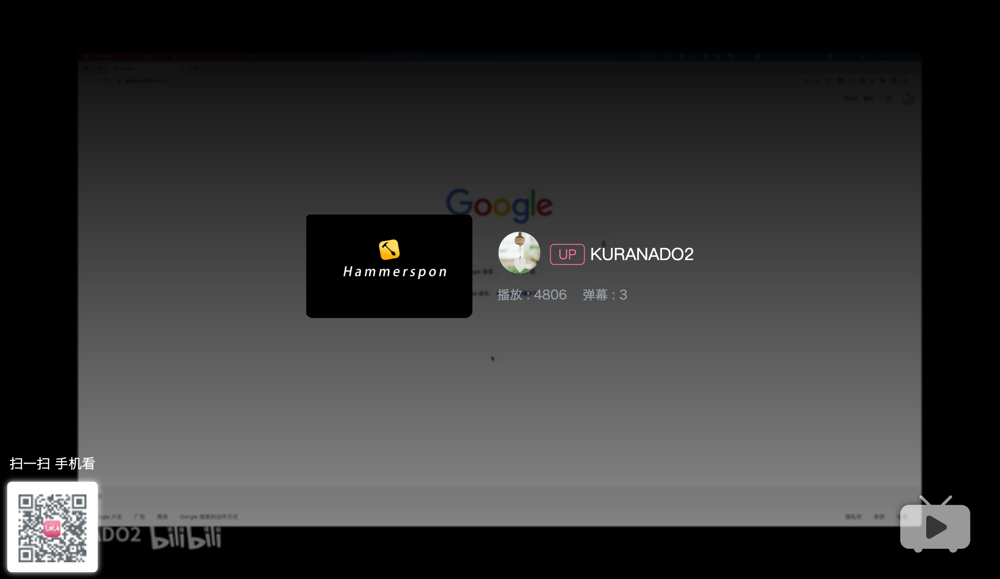
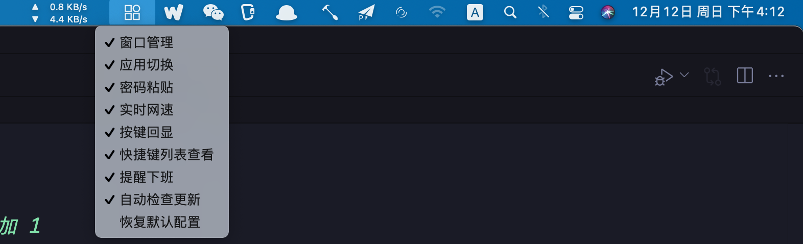
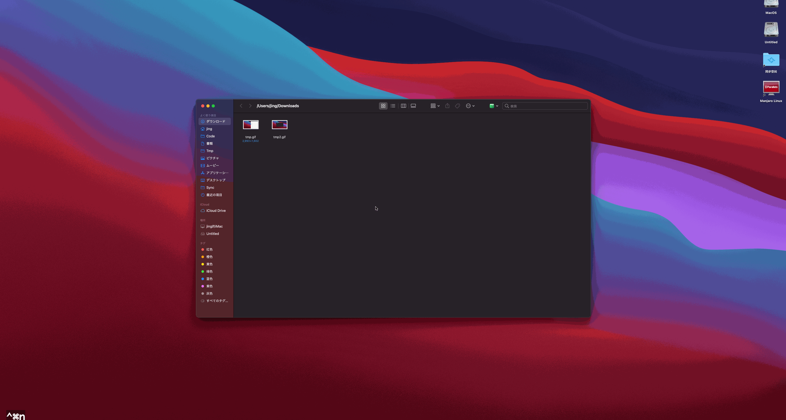
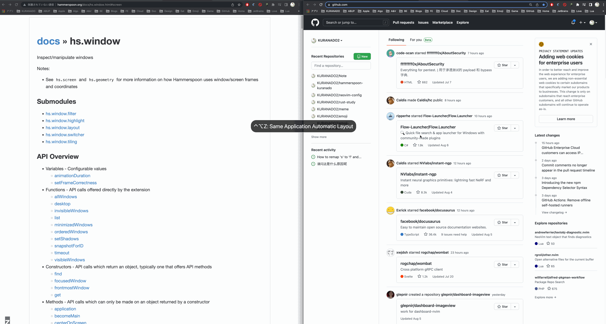
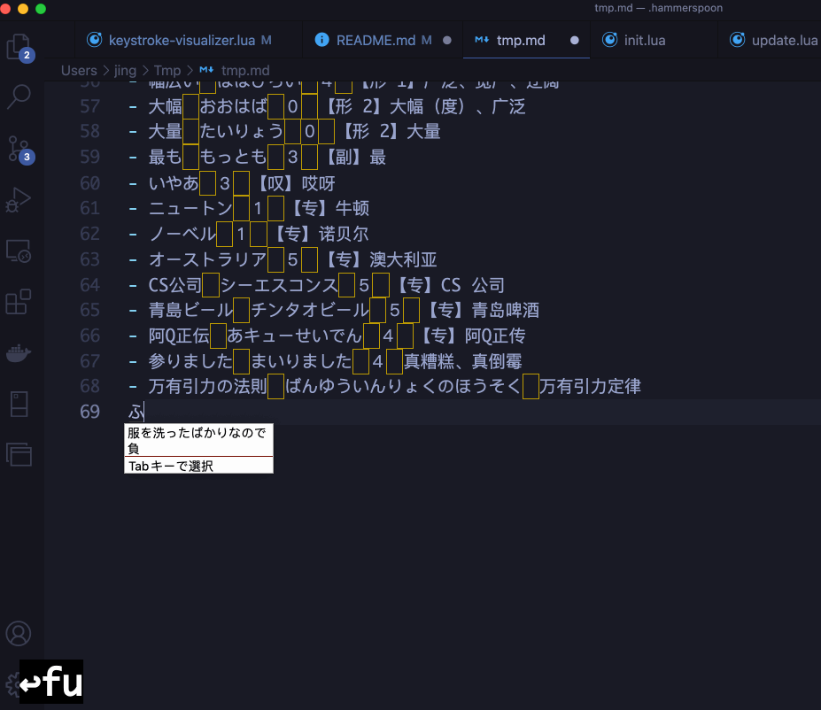
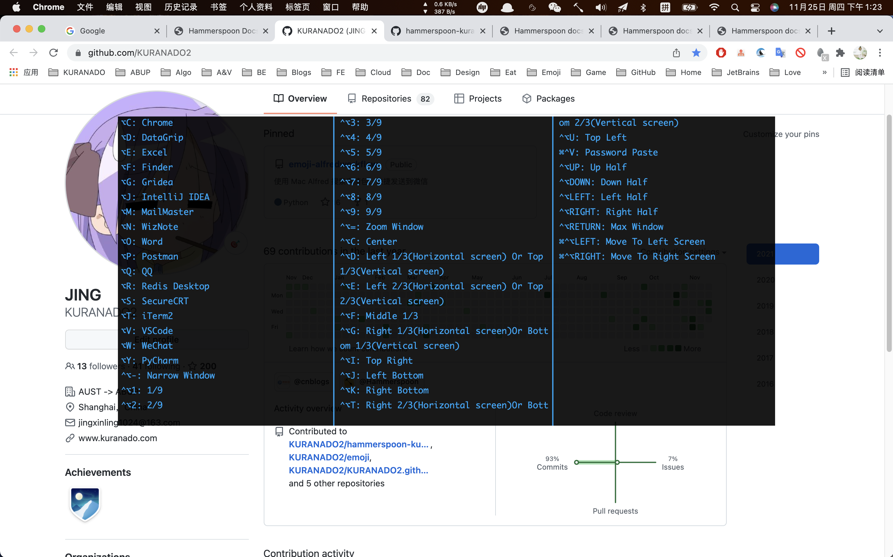
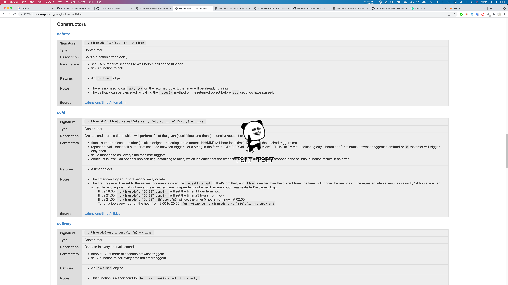
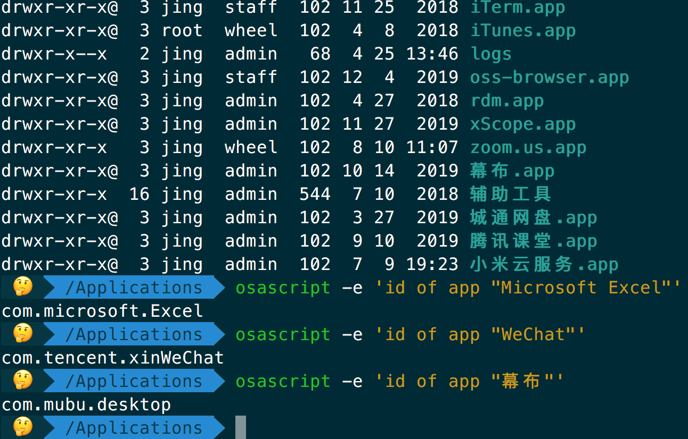
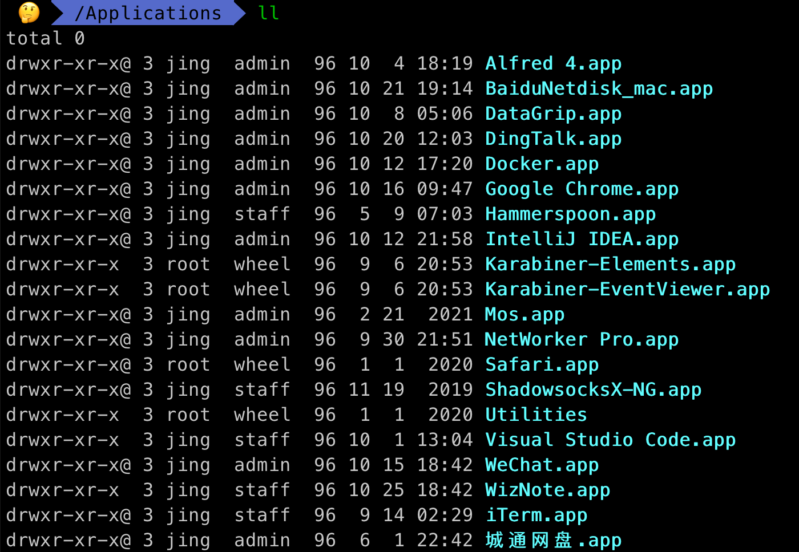
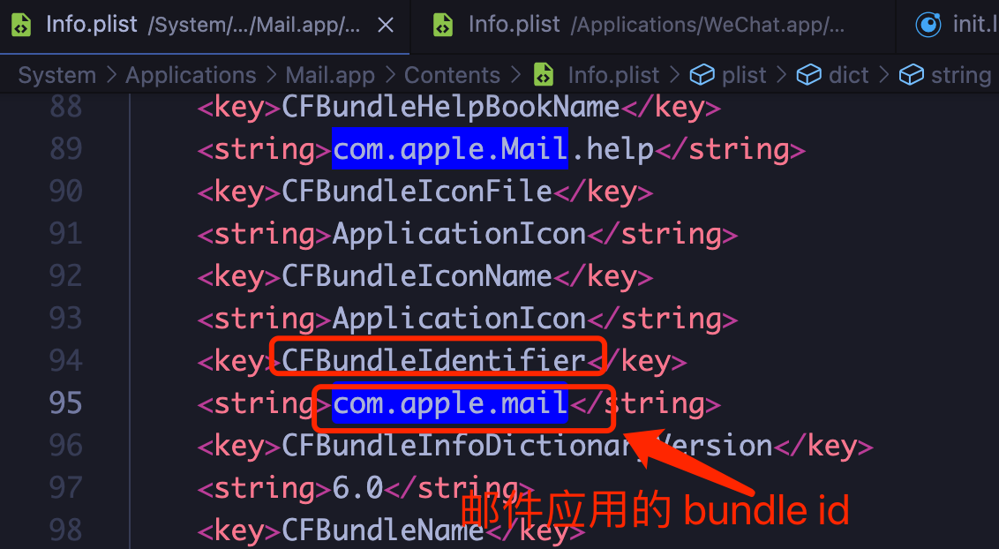

<div align='center'>
    
</div>

<div align='center'>
  
  
  
</div>

[English](./README.md) | [简体中文](./README-CN.md) | 日本語

---

[](https://www.bilibili.com/video/BV1VR4y1N7TS?share_source=copy_web&vd_source=a06ac1449f22652843e9948a04dc214a)

---

- このプロジェクトが提供する機能があなたに役立つと思うなら、星をクリックするのを手伝ってください、それは大いにありがたいです、ありがとう！

<div align='left'>
  
</div>

- README 画像を表示できない場合は、ラダーがハングしていて、PACファイルで `|| githubusercontent.com` が設定されていることを確認するか、グローバルモードを直接使用してください

---

## インストールする方法

このプロジェクトのすべてのスクリプトは Hammerspoon に基づいています。[Hammerspoon](https://github.com/Hammerspoon/hammerspoon/releases) をダウンロードしてインストールし、次のコマンドを実行してください。

```shell
curl -fsSL https://raw.githubusercontent.com/KURANADO2/hammerspoon-kuranado/main/install.sh | sh
```

上記の `curl` コマンドで `install.sh` をダウンロードできない場合は、ターミナルエージェントを開いて再試行するか、手動で `install.sh` **をダウンロードして実行してください**。

最後に、メニューバーの Hammerspoon `Reload Config` ボタンをクリックします

---

## 手動更新

更新を手動でインストールするには：

```shell
cd ~/.hammerspoon
git pull origin main
```

競合が見つかった場合は、競合を解決してから `git pull origin main` を実行します

---

## 自動更新

手動更新に加えて、このプロジェクトは自動更新チェックとインストールもサポートしており、自動更新は機能メニューでオフにすることができます（非推奨）

自動更新の原則は次のとおりです。
- .gitignore ファイルに .config ファイル（ユーザー構成ファイル）が追加されました
- 定期的に `git pull origin main` を実行します
- 競合が見つかった場合、コンソールは自動更新の失敗に関する情報を出力します。この場合、更新を手動でインストールしてください。[手動更新](https://github.com/KURANADO2/hammerspoon-kuranado#%E6%89%8B%E5%8A%A8%E6%9B%B4%E6%96%B0) を参照してください。 
- デフォルトの構成バージョン番号 > ユーザーのローカル .config ファイルの構成バージョン番号が見つかった場合、新しい構成は、ユーザーの元の構成と構成を保持することに基づいて、ユーザーのローカル .config ファイルにマージされます。バージョン番号が更新されます

---

## このプロジェクトは機能を提供します
### 機能メニュー

機能項目をマウスでクリックして、機能項目を有効/無効にします

<div align='center'>
  
</div>

---

### ウィンドウ移動

ウィンドウの移動には、[Magnet](https://apps.apple.com/us/app/magnet/id441258766?mt=12) の代替手段

<div align='center'>
  
</div>

均等に分割されたグリッド (2、4、6、9、12、16 など)：

<div align='center'>
  
</div>

左右を入れ替える：

<div align='center'>
  
</div>

---

### アプリケーションスイッチ

アプリケーションのショートカットキーを構成します。これは、 `⌘` `⇥` や Alfred スイッチングプログラムよりも効率的です（頻繁に使用される一部のソフトウェアにのみショートカットキーを割り当てることをお勧めします）

---

### 絵文字検索

ショートカットキー `⌥` `K` を使用して絵文字検索機能を起動し、キーワードを入力します。**上下**キーを使用して絵文字を選択およびプレビューします。**左右**キーを使用してページをめくります。**Enterキー**絵文字の送信に使用; `Esc` は検索ウィンドウを閉じます

<div align='center'>
  
</div>

**注：** この関数を Alfred ワークフローに実装しました：[https://github.com/KURANADO2/emoji-alfredworkflow](https://github.com/KURANADO2/emoji-alfredworkflow)。 しかし、それは長い間維持されていません、あなたがアルフレッドに興味があるなら、あなたはまた見ることができます

---

### リアルタイムのインターネット速度表示

[NetWorker Pro](https://apps.apple.com/us/app/networker-pro/id1163602886?mt=12) を置き換えますネットワーク速度をリアルタイムで表示します（2 秒ごとに更新します）

<div align='center'>
  
</div>

---

### パスワードの貼り付け

一部の Web サイトでパスワードの貼り付けが禁止されており、SSH ログインでは手動でパスワードを入力する必要があるという問題を解決します。
最初に `⌘` `C` を使用してパスワードをコピーし、次にパスワード入力ボックスで `⌃``⌘``V` を押してパスワードを入力ボックスに貼り付けます。
原則は、クリップボードの最新のレコードを読み取り、読み取られた各文字のキーイベントをシミュレートすることです。

---

### 入力方式の切り替え

個人に対して最も一般的に使用される 3 つの入力方法：
- システムには ABC が付属しています
- システムには簡略化された拼音が付属しています
- システムには日本語入力方式が付属しています

ショートカット|機能
-|-
`⌥` `J`|ABC
`⌥` `K`|簡体字拼音
`⌥` `L`|日本語入力方式

---

### キーエコー

[KeyCastr](https://github.com/keycastr/keycastr) の代替

<div align ='center'>
   
</div>

注：現在、単純なキーエコーが実装されていますが、次のように、機能的にはまだ KeyCastr からはほど遠いです。
- マルチキャンバスはサポートされていません
- Canvas はドラッグアンドドロップをサポートしていません
- アニメーション効果の欠如
- ...
興味のある方は、実装のアイデアを提案したり、コードを直接提供したりできます（Objective-C をよく理解しておらず、KeyCastr の実装ソースコードを個人的に理解するのは困難です）

---

### 壁紙の切り替え

10 分ごとに壁紙を自動的に切り替える、壁紙の出典: Bing

---

### ショートカットリストビュー

ショートカットキーリストを表示/非表示にするには、任意のインターフェイスで `⌥` `/` を押します

<div align='center'>
  
</div>

---

### 仕事を降りた後のリマインダー

毎日 18:00 に仕事を辞めることを忘れないでください（実際の勤務時間に応じてスクリプトを変更してください）。マウスをクリックしてアニメーションを閉じます。

<div align='center'>
  
</div>

---

## デフォルトのショートカットリスト

ショートカットキーをカスタマイズするには、shortcut.lua ファイルを変更してください。shortcut.lua ファイルが存在しない場合は、次のコマンドを実行して作成します。

```shell
cp shortcut.lua.example shortcut.lua
```

ショートカット|機能
-|-
`⌃` `⌥` `Z`|同じアプリの複数のウィンドウの自動表形式レイアウト
`⌃` `⌥` `X`|同じワークスペース内のすべてのウィンドウの自動グリッド レイアウト（[ワークスペース](https://support.apple.com/zh-cn/guide/mac-help/mh14112/mac)とは？）
`⌃` `⌥` `A`|同じアプリのすべてのウィンドウが自動的に水平または垂直に分割されます
`⌃` `⌥` `S`|同じワークスペース内のすべてのウィンドウが自動的に水平または垂直に分割されます
`⌃` `⌥` `←`|左半分の画面
`⌃` `⌥` `→`|右半分の画面
`⌃` `⌥` `↑`|上半分の画面
`⌃` `⌥` `↓`|下半分の画面
`⌃` `⌥` `U`|左上隅
`⌃` `⌥` `I`|右上隅
`⌃` `⌥` `J`|左下
`⌃` `⌥` `K`|右下隅
`⌃` `⌥` `1`|1/9
`⌃` `⌥` `2`|2/9
`⌃` `⌥` `3`|3/9
`⌃` `⌥` `4`|4/9
`⌃` `⌥` `5`|5/9
`⌃` `⌥` `6`|6/9
`⌃` `⌥` `7`|7/9
`⌃` `⌥` `8`|8/9
`⌃` `⌥` `9`|9/9
`⌃` `⌥` `C`|センター
`⌃` `⌥` `D`|左1/3（水平スクリーン）または上1/3（垂直スクリーン）
`⌃` `⌥` `F`|ミディアム1/3
`⌃` `⌥` `G`|右1/3（水平スクリーン）または下1/3（垂直スクリーン）
`⌃` `⌥` `E`|左2/3（水平スクリーン）または上2/3（垂直スクリーン）
`⌃` `⌥` `T`|右2/3（水平スクリーン）または下2/3（垂直スクリーン）
`⌃` `⌥` `=`|ウィンドウを同じ割合で拡大します
`⌃` `⌥` `-`|ウィンドウを比例的に縮小します
`⌃` `⌥` `↩`|最大化
`⌃` `⌥` `⌘` `↑`|ウィンドウを上部画面に移動します
`⌃` `⌥` `⌘` `↓`|ウィンドウを下の画面に移動します
`⌃` `⌥` `⌘` `←`|ウィンドウを左側の画面に移動します
`⌃` `⌥` `⌘` `→`|ウィンドウを右画面に移動します
`⌘` &#96; |在同一应用的多个窗口之间切换（此为 Mac 系统自带快捷键）
`⌥` `Q`|QQ を開く
`⌥` `W`|WeChat を開く
`⌥` `V`|VisualStudio コードを開く
`⌥` `F`|ファインダーを開く
`⌥` `C`|Chrome を開く
`⌥` `J`|Intellij IDEA を開く
`⌥` `N`|WizNote を開く
`⌥` `D`|DataGrip を開く
`⌥` `T`|iTerm2 を開く
`⌥` `M`|MailMaster を開く
`⌥` `P`|オープンポストマン
`⌥` `O`|オープンワード
`⌥` `E`|Excel を開く
`⌥` `Y`|PyCharm を開く
`⌥` `R`|Another Redis Desktop Manager を開く
`⌥` `K`|絵文字検索
`⌃` `⌘` `V`|キーストロークをシミュレートしてクリップボードに文字を貼り付けます（一部の Web サイトでパスワードの貼り付けが禁止されている問題を解決するため）
`⌥` `L`|簡体字拼音と日本語入力方式を切り替える
`⌥` `/`|ショートカットリストの表示/非表示

---

## だいたい
### app bundle id について

上記の構成では、ショートカットキーを使用してアプリケーションを切り替える必要があります。アプリケーションの bundle ID を取得する必要があります（hammerspoon で構成された bundle ID では大文字と小文字が区別される必要があります。大文字と小文字が区別されない場合、コンソールでエラーが報告されます）。次のように取得されます。
```shell
osascript -e 'id of app "Name of App"'
```

<div align='center'>
  
</div>

また、比較的新しい Mac システムを使用している場合は、Terminal に `ls /Applications` と入力すると、システムに付属のアプリケーションが表示されない場合があります。以下に示すように、`ll` には付属のメールアプリケーションが表示されません。 Mac ですが、Finder は /Applications ディレクトリを開いて、メールアプリケーションを表示します

<div align='center'>
  
</div>

この場合、Finder でメールアプリケーションを選択し、右クリックします。パッケージの内容を表示 -> Contents -> info.plist ファイルを開き、CFBundleIdentifier 構成アイテムを見つけます。この構成アイテムの値は、bundle ID です。もちろん、この方法は自己インストールアプリにも適しています

<div align='center'>
  
</div>

---

### プロジェクトのディレクトリ構造について

```shell
.hammerspoon
├── .config ユーザーの各機能モジュールの有効/無効ステータスを保存するユーザーローカル構成ファイル
├── .emoji 絵文字キャッシュディレクトリ
├── .git
├── .gitignore
├── .wallpaper 壁紙キャッシュ ディレクトリ
├── LICENSE
├── README.md
├── images modules と README に必要な写真
├── init.lua スクリプトエントリ
└── modules 各機能モジュール
    ├── application.lua アプリケーションスイッチモジュール
    ├── base.lua 基本的な Lua ツールをカプセル化します
    ├── config.lua 各機能のデフォルトの有効/無効ステータスを記録するメニューのデフォルト設定
    ├── emoji.lua 絵文字検索モジュール
    ├── hotkey.lua ショートカットリストビューモジュール
    ├── input-method.lua 入力方式スイッチ
    ├── keystroke-visualizer.lua キーエコーモジュール
    ├── menu.lua メニューモジュール
    ├── network.lua リアルタイムインターネットスピードモジュール
    ├── password.lua パスワード貼り付けモジュール
    ├── reload.lua 構成モジュールをリロードします（~/.hammerspoon ディレクトリ内の .lua ファイルが変更されると、Hammerspoon 構成が自動的にリロードされます）
    ├── remind.lua オフデューティリマインダーモジュール
    ├── shortcut.lua ユーザー定義のショートカットキーに使用され、このファイルは .gitignore に追加されました。そのようなファイルがない場合は、コマンド cp shortcut.lua.example shortcut.lua を実行してコピーを作成してください
    ├── shortcut.lua.example ショートカットキー構成ファイルの例。ユーザーはこのファイルを変更しないでください
    ├── update.lua モジュールを自動的に更新する
    ├── .wallpaper 壁紙スイッチモジュール
    └── window.lua ウィンドウ管理モジュール
```

---

## Thanks

- [JetBRAINS- Licenses for Open Source Development](https://www.jetbrains.com/community/opensource/#support)

---

## 参照

- [学长博客 - OSX--OSX应用快速切换方案](https://mrdear.cn/posts/osx_app_switcher.html)
- [官方 Quick Start](https://www.hammerspoon.org/go/)
- [官方文档](http://www.hammerspoon.org/docs/)
- [hammerspoon-init](https://github.com/rtoshiro/hammerspoon-init)
- [Easily see any app’s bundle identifier](https://robservatory.com/easily-see-any-apps-bundle-identifier/)
- [GitHub - wangshub/hammerspoon-config](https://github.com/wangshub/hammerspoon-config)
- [GitHub - ashfinal/awesome-hammerspoon](https://github.com/ashfinal/awesome-hammerspoon)
- [GitHub - forecho/hammerspoon-config](https://github.com/forecho/hammerspoon-config)
- [Is it possible to show what a keycode being pressed is?](https://github.com/Hammerspoon/hammerspoon/issues/2937)
- [GitHub - niumoo/bing-wallpaper](https://github.com/niumoo/bing-wallpaper)
