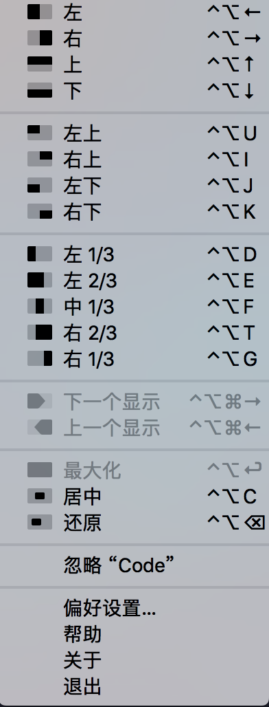
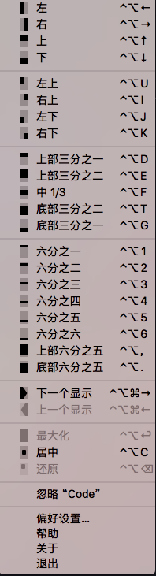
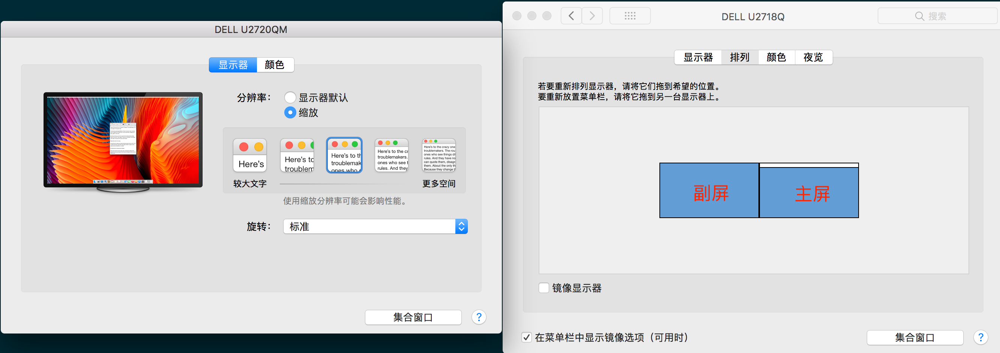

[TOC]

## 使用
```
cd ~/.hammerspoon
git clone https://github.com/KURANADO2/hammerspoon-kuranado.git
mv hammerspoon-kuranado/* .
mv hammerspoon-kuranado/.git .
mv hammerspoon-kuranado/.gitignore .
```

## Hammerspoon 作用
- 替代 Magnet 进行窗口移动
之前一直用 Magnet 移动窗口，使用 Hammerspoon 之后完全可以替代 Magnet，以下为 Magnet 横屏和竖屏分别支持的快捷键截图

横屏：



竖屏：



- 为应用配置快捷键，比 ⌘⇥ 和 Alfred 切换程序更高效（建议只为高频使用的一些软件分配快捷键）

## 个人配置快捷键列表

快捷键|功能
-|-
⌃⌥←|左半屏
⌃⌥→|右半屏
⌃⌥↑|上半屏
⌃⌥↓|下半屏
⌃⌥D|左 1/3（横屏）或上 1/3（竖屏）
⌃⌥F|中 1/3
⌃⌥G|右 1/3（横屏）或下 1/3（竖屏）
⌃⌥E|左 2/3（横屏）或上 2/3（竖屏）
⌃⌥T|右 2/3（横屏）或下 2/3（竖屏）
⌃⌥C|居中
⌃⌥=|等比例放大窗口
⌃⌥-|等比例缩小窗口
⌃⌥↩︎|最大化
⌃⌥⌘←|窗口由主屏移动到副屏
⌃⌥⌘→|窗口由副屏移动到主屏
⌥Q|打开 QQ
⌥W|打开 WeChat
⌥V|打开 Visual Studio Code
⌥F|打开 Finder
⌥C|打开 Chrome
⌥J|打开 Intellij IDEA
⌥N|打开 WizNote
⌥G|打开 Gridea
⌥D|打开 DataGrip
⌥T|打开 iTerm2
⌥M|打开 MailMaster
⌥P|打开 Postman
⌥O|打开 Word
⌥E|打开 Excel
⌥S|打开 SecureCRT

**注意：**屏幕之间移动窗口，需要保证主屏在右侧，副屏在左侧，这里的左侧、右侧指的是显示器的逻辑位置，而不是物理位置，当然一般大家都会保证逻辑位置和物理位置一致，以方便操作。所谓的逻辑位置，可在：系统偏好设置 -> 显示器 -> 排列 下设置：



我有两台显示器，一台放在桌子的左边，一台放在桌子的右边，这就是物理位置。为了操作方便，如上图，我将实际桌子上左边的显示器排列在左边，桌子上右边的显示器排列在右边，这样就保证了物理位置和逻辑位置是一致的，同时将上图中的白色条块拖动到右侧显示器上，用于标识右侧的显示器是主显示器。

## 个人配置文件

见 GitHub：[init.lua](init.lua)

## 关于应用 bundle id

上面配置中使用快捷键切换应用，需要拿到应用的 bundle id（请注意 bundle id 配置到 hammerspoon 中需要区分大小写，否则 console 会报错），可通过如下方式拿到：
```
osascript -e 'id of app "Name of App"'
```


## 参考
- [学长博客 - OSX--OSX应用快速切换方案](https://mrdear.cn/posts/osx_app_switcher.html)
- [官方 Quick Start](https://www.hammerspoon.org/go/)
- [官方文档](http://www.hammerspoon.org/docs/)
- [少数派 - 免费又强大的 macOS 自动化工具，Hammerspoon 可以让你少买很多 App](https://sspai.com/post/53992)
- [V2EX - 推荐一个 MacOS 上用了就无法自拔的神器](https://www.v2ex.com/t/553241)
- [Hammerspoon - 岂止于窗口管理](https://zhuanlan.zhihu.com/p/72499152)
- [hammerspoon-init](https://github.com/rtoshiro/hammerspoon-init)
- [菜鸟教程 - Lua 教程](https://www.runoob.com/lua/lua-tutorial.html)
- [Easily see any app’s bundle identifier](https://robservatory.com/easily-see-any-apps-bundle-identifier/)
