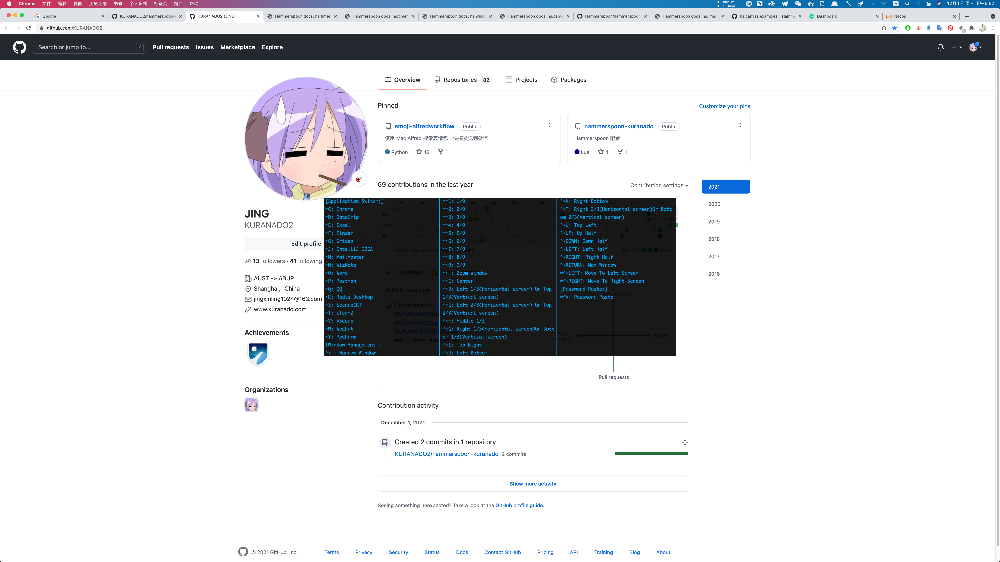
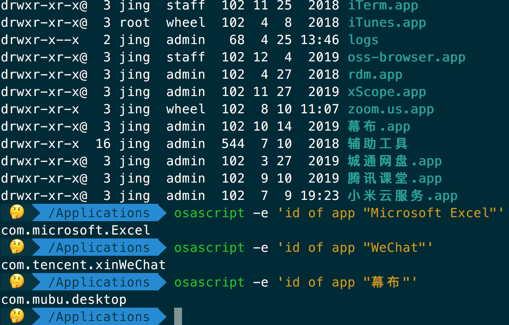
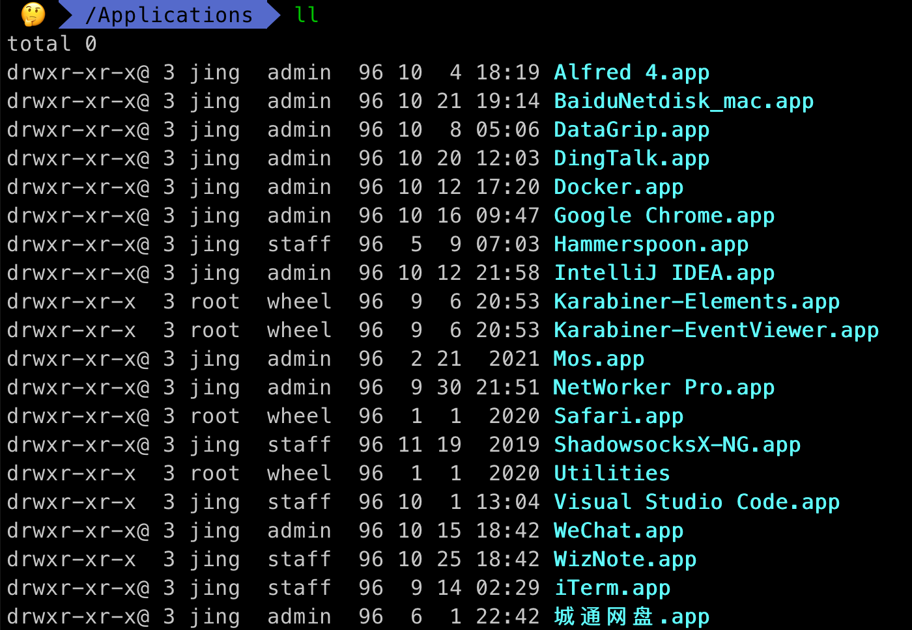
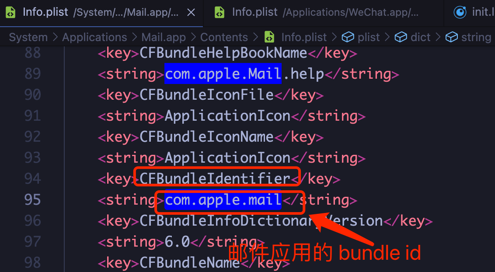

[TOC]

**注：**若 README 图片无法显示，请确保挂了梯子，并且 PAC 文件中配置 `||githubusercontent.com`，或者直接使用全局模式

## 如何安装

本工程所有脚本都基于 Hammerspoon 运行，请先下载安装 [Hammerspoon](https://github.com/Hammerspoon/hammerspoon/releases)，然后再执行如下命令

```
cd ~/.hammerspoon
rm -rf *
git init
git remote add origin git@github.com:KURANADO2/hammerspoon-kuranado.git
git pull origin main
```

## 手动更新

手动安装更新：

```
cd ~/.hammerspoon
git pull origin main
```

如果发现冲突，请解决冲突后再执行 `git pull origin main`

## 自动更新

除手动更新外，本工程还支持自动检查更新并安装，可在功能菜单中关闭自动更新（不建议）

自动更新原理如下：
- .config 文件（用户配置文件）加入到 .gitignore 文件中
- 定期执行 `git pull origin main`
- 如果发现冲突，则 console 打印自动更新失败相关提示信息，此时请手动安装更新，参考：[手动更新](https://github.com/KURANADO2/hammerspoon-kuranado#%E6%89%8B%E5%8A%A8%E6%9B%B4%E6%96%B0)
- 如果发现默认配置版本号 > 用户本地 .config 文件的配置版本号，则在保留用户原有配置的基础上，将新增配置合并到用户本地 .config 文件中，并更新配置版本号

## 本工程提供功能
### 窗口移动

替代 [Magnet](https://apps.apple.com/us/app/magnet/id441258766?mt=12) 进行窗口移动


### 应用切换

为应用配置快捷键，比 ⌘⇥ 和 Alfred 切换程序更高效（建议只为高频使用的一些软件分配快捷键）

### 实时网速显示

替代 [NetWorker Pro](https://apps.apple.com/us/app/networker-pro/id1163602886?mt=12) 实时显示网速（每两秒刷新一次）


### 密码粘贴

解决某些网站禁止粘贴密码、SSH 登陆需要手动输入密码等问题。
首先使用 ⌘C 复制密码，然后在密码输入框内，按 ⌃⌘V 即可将密码粘贴到输入框内。
原理为读取剪贴板最新一条记录，针对读取到的每一个字符，模拟按键事件。

### 按键回显

替代 [KeyCastr](https://github.com/keycastr/keycastr)


注：目前暂且实现了简单的按键回显，和 KeyCastr 相比在功能上仍相差甚远，如：
- 不支持多画布
- 长时间未接收到按键事件，不支持自动淡出画布（增加计时器可以做到，实际这部分代码也已经实现，但 Hammerspoon 提供的计时器总会无故挂掉，所以暂时删除了该功能）
- 画布不支持拖拽
- ...
感兴趣的同学欢迎提出实现思路，或直接贡献代码（不太懂 Objective-C，KeyCastr 的实现源码个人看不太懂）

### 快捷键列表查看

任意界面下按 ⌥/ 显示/隐藏快捷键列表



### 下班提醒

每天 18:00 提醒下班（根据实际下班时间自行修改脚本），鼠标点击可关闭动画


### 功能菜单

鼠标单击功能项，即可启用/禁用功能项


## 快捷键列表

请根据需要自行修改

快捷键|功能
-|-
⌃⌥←|左半屏
⌃⌥→|右半屏
⌃⌥↑|上半屏
⌃⌥↓|下半屏
⌃⌥U|左上角
⌃⌥I|右上角
⌃⌥J|左下角
⌃⌥K|右下角
⌃⌥1|1/9
⌃⌥2|2/9
⌃⌥3|3/9
⌃⌥4|4/9
⌃⌥5|5/9
⌃⌥6|6/9
⌃⌥7|7/9
⌃⌥8|8/9
⌃⌥9|9/9
⌃⌥C|居中
⌃⌥D|左 1/3（横屏）或上 1/3（竖屏）
⌃⌥F|中 1/3
⌃⌥G|右 1/3（横屏）或下 1/3（竖屏）
⌃⌥E|左 2/3（横屏）或上 2/3（竖屏）
⌃⌥T|右 2/3（横屏）或下 2/3（竖屏）
⌃⌥=|等比例放大窗口
⌃⌥-|等比例缩小窗口
⌃⌥↩︎|最大化
⌃⌥⌘→|窗口由左边屏幕移动到右边屏幕
⌃⌥⌘←|窗口由右边屏幕移动到左边屏幕
⌥Q|打开 QQ
⌥W|打开 WeChat
⌥V|打开 Visual Studio Code
⌥F|打开 Finder
⌥C|打开 Chrome
⌥J|打开 Intellij IDEA
⌥N|打开 WizNote
⌥G|打开 Gridea
⌥D|打开 DataGrip
⌥T|打开 iTerm2
⌥M|打开 MailMaster
⌥P|打开 Postman
⌥O|打开 Word
⌥E|打开 Excel
⌥S|打开 SecureCRT
⌥Y|打开 PyCharm
⌥R|打开 Another Redis Desktop Manager
⌃⌘V|以模拟按键方式将剪贴板中的字符粘贴出来（解决某些网站禁止粘贴密码问题）
⌥/|显示/隐藏快捷键列表

## 关于不同屏幕间的窗口移动

关于窗口管理，如下两个快捷键用于在屏幕之间移动窗口

快捷键|功能
-|-
⌃⌥⌘→|窗口由左边屏幕移动到右边屏幕
⌃⌥⌘←|窗口由右边屏幕移动到左边屏幕

找到系统偏好设置 -> 显示器 -> 排列，请确保摆在桌子左边的屏幕，排列中也设置为左边；同理摆在桌子右边的屏幕，排列中也设置为右边。如果有更多显示器，也是一样，请保证排列中的位置和现实中的摆放位置一致。

排列中的设置：


摆放位置：


## 关于应用 bundle id

上面配置中使用快捷键切换应用，需要拿到应用的 bundle id（请注意 bundle id 配置到 hammerspoon 中需要区分大小写，否则 console 会报错），可通过如下方式拿到：
```
osascript -e 'id of app "Name of App"'
```



另外，如果你使用的是比较新的 Mac 系统，终端下输入 ls /Applications 可能是看不到系统自带应用的，如下图，ll 查看不到 Mac 自带的邮件应用，但 Finder 打开 /Applications 目录则可以看到邮件应用



此时我们可以在 Finder 中选中邮件应用，右键：显示包内容 -> Contents -> 打开 info.plist 文件，找到 CFBundleIdentifier 配置项，该配置项的值即为 bundle id，当然此方法也适应于自己安装的应用



## 参考
- [学长博客 - OSX--OSX应用快速切换方案](https://mrdear.cn/posts/osx_app_switcher.html)
- [官方 Quick Start](https://www.hammerspoon.org/go/)
- [官方文档](http://www.hammerspoon.org/docs/)
- [少数派 - 免费又强大的 macOS 自动化工具，Hammerspoon 可以让你少买很多 App](https://sspai.com/post/53992)
- [V2EX - 推荐一个 MacOS 上用了就无法自拔的神器](https://www.v2ex.com/t/553241)
- [Hammerspoon - 岂止于窗口管理](https://zhuanlan.zhihu.com/p/72499152)
- [hammerspoon-init](https://github.com/rtoshiro/hammerspoon-init)
- [菜鸟教程 - Lua 教程](https://www.runoob.com/lua/lua-tutorial.html)
- [Easily see any app’s bundle identifier](https://robservatory.com/easily-see-any-apps-bundle-identifier/)
- [GitHub - wangshub/hammerspoon-config](https://github.com/wangshub/hammerspoon-config)
- [GitHub - ashfinal/awesome-hammerspoon](https://github.com/ashfinal/awesome-hammerspoon)
- [Is it possible to show what a keycode being pressed is?](https://github.com/Hammerspoon/hammerspoon/issues/2937)