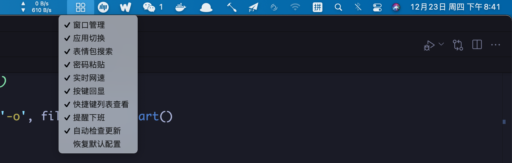
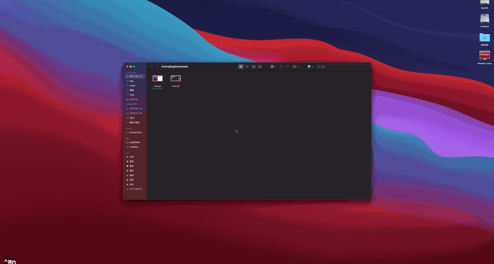
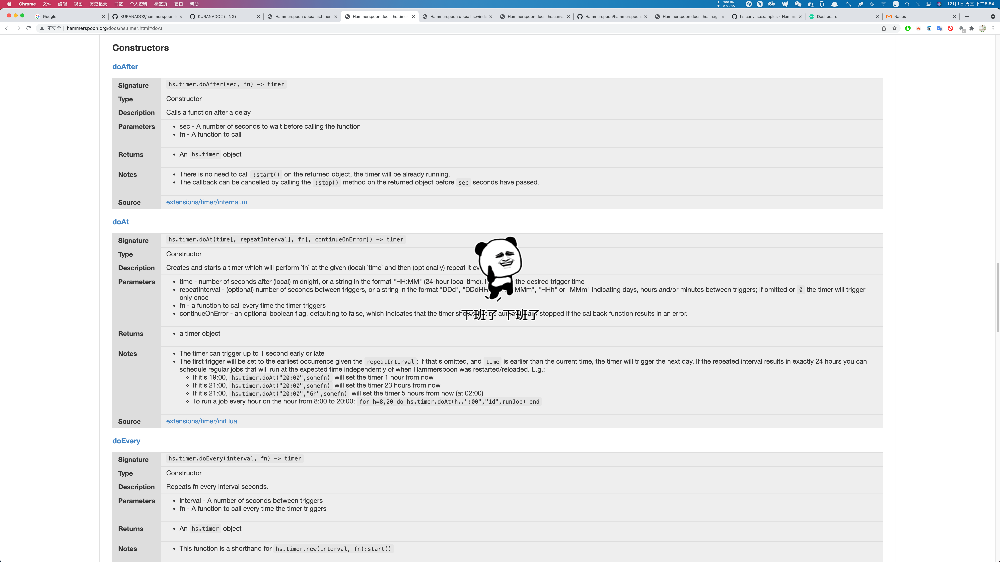

<div align='center'>
    
</div>

<div align='center'>
  
  
  
</div>

English | [简体中文](./README-CN.md) | [日本語](./README-JP.md)

---

[](https://www.bilibili.com/video/BV1VR4y1N7TS?share_source=copy_web&vd_source=a06ac1449f22652843e9948a04dc214a)

---

- If you think the functions provided by this project are useful to you, please help to click a Star, it would be greatly appreciated, thank you!

<div align='left'>
  
</div>

- If the README image cannot be displayed, please make sure that the ladder is hung and `||githubusercontent.com` is configured in the PAC file, or directly use the global mode

---

## How to install

All scripts in this project are based on Hammerspoon. Please download and install [Hammerspoon](https://github.com/Hammerspoon/hammerspoon/releases), and then execute the following commands:

```shell
curl -fsSL https://raw.githubusercontent.com/KURANADO2/hammerspoon-kuranado/main/install.sh | sh
```

If the above `curl` command cannot download `install.sh`, please open the terminal agent and try again or manually download `install.sh` and execute it

Finally, click the Hammerspoon `Reload Config` button in the Menubar

---

## Manual update

To install updates manually:

```shell
cd ~/.hammerspoon
git pull origin main
```

If a conflict is found, resolve the conflict and then execute `git pull origin main`

---

## Auto update

In addition to manual update, this project also supports automatic update check and installation, and automatic update can be turned off in the function menu (not recommended)

The automatic update principle is as follows:
- .config file (user configuration file) added to .gitignore file
- Periodically execute `git pull origin main`
- If a conflict is found, the console will print the information about the failure of automatic update. In this case, please install the update manually, refer to: [Manual update](https://github.com/KURANADO2/hammerspoon-kuranado#%E6%89%8B%E5%8A%A8%E6%9B%B4%E6%96%B0)
- If it is found that the default configuration version number > the configuration version number of the user's local .config file, the new configuration will be merged into the user's local .config file on the basis of retaining the user's original configuration, and the configuration version number will be updated

---

## This project provides functions
### Function menu

Click the function item with the mouse to enable/disable the function item

<div align='center'>
  
</div>

---

### Window move

Alternative to [Magnet](https://apps.apple.com/us/app/magnet/id441258766?mt=12) for window movement

<div align='center'>
  
</div>

Grid evenly divided (2, 4, 6, 9, 12, 16, etc.):

<div align='center'>
  
</div>

Swap left and right:

<div align='center'>
  
</div>

---

### Application switch

Configure shortcut keys for applications, which is more efficient than `⌘` `⇥` and Alfred switching programs (it is recommended to assign shortcut keys only to some software that are frequently used)

---

### Emoji search

Shortcut keys `⌥` `K` to wake up the emoji search function, enter keywords, **up and down** keys are used to select and preview emoji packages; **left and right** keys are used to turn pages; **Enter key** Used to send emojis; `Esc` closes the search window

<div align='center'>
  
</div>

**Note:** I have implemented this function in Alfred Workflow: [https://github.com/KURANADO2/emoji-alfredworkflow](https://github.com/KURANADO2/emoji-alfredworkflow). But it has not been maintained for a long time, if you are interested in Alfred, you can also take a look

---

### Real-time internet speed display

Replaces [NetWorker Pro](https://apps.apple.com/us/app/networker-pro/id1163602886?mt=12) Display network speed in real time (refresh every two seconds)

<div align='center'>
  
</div>

---

### Password paste

Solve the problem that some websites prohibit pasting passwords, and SSH login requires manual password input.
First use `⌘` `C` to copy the password, then in the password input box, press `⌃` `⌘` `V` to paste the password into the input box.
The principle is to read the latest record of the clipboard, and simulate a key event for each character read.

---

### Input method switch

The three most commonly used input methods for individuals:
- The system comes with ABC
- The system comes with Simplified Pinyin
- The system commes with Japanese Input

Shortcut | Function
-|-
`⌥` `J`|ABC
`⌥` `K`|Simplified Pinyin
`⌥` `L`|Japanese Input Method

---

### Key echo

Alternative to [KeyCastr](https://github.com/keycastr/keycastr)

<div align='center'>
   
</div>

Note: At present, a simple key echo has been implemented, which is still far from KeyCastr in function, such as:
- Multi-canvas is not supported
- Canvas does not support drag and drop
- lack of animation effects
- ...
Interested guys are welcome to propose implementation ideas, or directly contribute code (do not understand Objective-C very well, and the implementation source code of KeyCastr cannot be understood personally)

---

### Wallpaper switch

Automatically switch a wallpaper every 10 minutes, wallpaper source: Bing

---

### Shortcut list view

Press `⌥` `/` in any interface to show/hide the shortcut key list

<div align='center'>
  
</div>

---

### Reminder after get off work

Remind to get off work at 18:00 every day (modify the script according to the actual off-duty time), click the mouse to close the animation

<div align='center'>
  
</div>

---

## Default shortcut list

To customize shortcut keys, please modify the shortcut.lua file. If the shortcut.lua file does not exist, execute the following command to create a copy

```shell
cp shortcut.lua.example shortcut.lua
```

Shortcut | Function
-|-
`⌃` `⌥` `Z`|Automatic grid layout of multiple Windows of the same application
`⌃` `⌥` `X`|Automatic grid layout of all windows in the same workspace（What is [workspace?](https://support.apple.com/guide/mac-help/work-in-multiple-spaces-mh14112/mac)？）
`⌃` `⌥` `A`|All windows of the same app are automatically divided horizontally or vertically
`⌃` `⌥` `S`|All windows in the same workspace are automatically divided horizontally or vertically
`⌃` `⌥` `←`|Left half screen
`⌃` `⌥` `→`|Right half screen
`⌃` `⌥` `↑`|Top half screen
`⌃` `⌥` `↓`|Lower half screen
`⌃` `⌥` `U`|Top left corner
`⌃` `⌥` `I`|Top right corner
`⌃` `⌥` `J`|Lower left
`⌃` `⌥` `K`|Bottom right corner
`⌃` `⌥` `1`|1/9
`⌃` `⌥` `2`|2/9
`⌃` `⌥` `3`|3/9
`⌃` `⌥` `4`|4/9
`⌃` `⌥` `5`|5/9
`⌃` `⌥` `6`|6/9
`⌃` `⌥` `7`|7/9
`⌃` `⌥` `8`|8/9
`⌃` `⌥` `9`|9/9
`⌃` `⌥` `C`|Center
`⌃` `⌥` `D`|Left 1/3 (landscape) or top 1/3 (portrait)
`⌃` `⌥` `F`|Medium 1/3
`⌃` `⌥` `G`|Right 1/3 (landscape) or bottom 1/3 (portrait)
`⌃` `⌥` `E`|Left 2/3 (landscape) or top 2/3 (portrait)
`⌃` `⌥` `T`|Right 2/3 (landscape) or bottom 2/3 (portrait)
`⌃` `⌥` `=`|Enlarge the window in equal proportion
`⌃` `⌥` `-`|Reduce the window proportionally
`⌃` `⌥` `↩︎`|Maximize
`⌃` `⌥` `⌘` `↑`|Move the window to the upper screen
`⌃` `⌥` `⌘` `↓`|Move the window to the lower screen
`⌃` `⌥` `⌘` `←`|Move the window to the left screen
`⌃` `⌥` `⌘` `→`|Move the window to the right screen
`⌘` &#96; |在同一应用的多个窗口之间切换（此为 Mac 系统自带快捷键）
`⌥` `Q` |Open QQ
`⌥` `W` |Open WeChat
`⌥` `V` |Open Visual Studio Code
`⌥` `F` |Open Finder
`⌥` `C` |Open Chrome
`⌥` `J` |Open Intellij IDEA
`⌥` `N` |Open WizNote
`⌥` `D` |Open DataGrip
`⌥` `T` |Open iTerm2
`⌥` `M` |Open MailMaster
`⌥` `P` |Open Postman
`⌥` `O` |Open Word
`⌥` `E` |Open Excel
`⌥` `Y` |Open PyCharm
`⌥` `R` |Open Another Redis Desktop Manager
`⌥` `K` |Emoji search
`⌃` `⌘` `V`|Paste the characters in the clipboard by simulating keystrokes (to solve the problem that some websites prohibit pasting passwords)
`⌥` `L` |Switch between Simplified Pinyin and Japanese input methods
`⌥` `/` |Show/hide shortcut list

---

## About
### About app-bundle-id

In the above configuration, use shortcut keys to switch applications, you need to get the bundle id of the application (please note that the bundle id configured in hammerspoon needs to be case-sensitive, otherwise the console will report an error), which can be obtained as follows:
```shell
osascript -e 'id of app "Name of App"'
```

<div align='center'>
  
</div>

In addition, if you are using a relatively new Mac system, enter `ls /Applications` in the terminal, you may not see the application that comes with the system, as shown below, `ll` cannot see the mail application that comes with the Mac, but the Finder Open the /Applications directory to see the mail application

<div align='center'>
  
</div>

At this point, we can select the mail application in the Finder, right-click: show package content -> Contents -> open the info.plist file, find the CFBundleIdentifier configuration item, the value of this configuration item is the bundle id, of course, this method is also suitable for own installation. Applications

<div align='center'>
  
</div>

---

### About the project directory structure

```shell
.hammerspoon
├── .config User local configuration file, which saves the enabled/disabled status of each functional module of the user
├── .emoji Emoji cache directory
├── .git
├── .gitignore
├── .wallpaper Wallpaper cache directory
├── LICENSE
├── README.md
├── images Pictures needed for function modules and README
├── init.lua Script entry
└── modules Each functional module
    ├── application.lua Application switch module
    ├── base.lua Encapsulates basic Lua tools
    ├── config.lua Menu default configuration, which records the default enabled/disabled status of each function
    ├── emoji.lua Emoji search module
    ├── hotkey.lua Shortcut list view module
    ├── input-method.lua Input method switch
    ├── keystroke-visualizer.lua Key echo module
    ├── menu.lua Menu module
    ├── network.lua Real-time internet speed module
    ├── password.lua Password paste module
    ├── reload.lua Reload the configuration module (when any .lua file in the ~/.hammerspoon directory changes, the Hammerspoon configuration is automatically reloaded)
    ├── remind.lua Off-duty reminder module
    ├── shortcut.lua Used for user-defined shortcut keys, this file has been added to .gitignore, if there is no such file, execute the command cp shortcut.lua.example shortcut.lua to create a copy
    ├── shortcut.lua.example Example of shortcut key configuration file, users should not modify this file
    ├── update.lua Automatically update modules
    ├── wallpaper.lua Wallpaper switch module
    └── window.lua Window management module
```

---

## Thanks

- [JetBRAINS- Licenses for Open Source Development](https://www.jetbrains.com/community/opensource/#support)

---

## Refer

- [学长博客 - OSX--OSX应用快速切换方案](https://mrdear.cn/posts/osx_app_switcher.html)
- [Official Quick Start](https://www.hammerspoon.org/go/)
- [Official Document](http://www.hammerspoon.org/docs/)
- [hammerspoon-init](https://github.com/rtoshiro/hammerspoon-init)
- [Easily see any app’s bundle identifier](https://robservatory.com/easily-see-any-apps-bundle-identifier/)
- [GitHub - wangshub/hammerspoon-config](https://github.com/wangshub/hammerspoon-config)
- [GitHub - ashfinal/awesome-hammerspoon](https://github.com/ashfinal/awesome-hammerspoon)
- [GitHub - forecho/hammerspoon-config](https://github.com/forecho/hammerspoon-config)
- [Is it possible to show what a keycode being pressed is?](https://github.com/Hammerspoon/hammerspoon/issues/2937)
- [GitHub - niumoo/bing-wallpaper](https://github.com/niumoo/bing-wallpaper)
